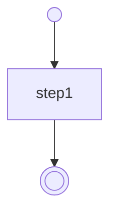

 [](https://gitpod.io/#https://github.com/open-workflow-specification/sdk-typescript)

- [Open Workflow Specification - TypeScript SDK](#open-workflow-specification---typescript-sdk)
  - [Status](#status)
  - [SDK Structure](#sdk-structure)
    - [Types and Interfaces](#types-and-interfaces)
    - [Classes](#classes)
    - [Fluent Builders](#fluent-builders)
    - [Validation Function](#validation-function)
    - [Other tools](#other-tools)
  - [Getting Started](#getting-started)
    - [Installation](#installation)
    - [Usage](#usage)
      - [Create a Workflow Definition from YAML or JSON](#create-a-workflow-definition-from-yaml-or-json)
      - [Create a Workflow Definition by Casting an Object](#create-a-workflow-definition-by-casting-an-object)
      - [Create a Workflow Definition Using a Class Constructor](#create-a-workflow-definition-using-a-class-constructor)
      - [Create a Workflow Definition Using the Builder API](#create-a-workflow-definition-using-the-builder-api)
      - [Serialize a Workflow Definition to YAML or JSON](#serialize-a-workflow-definition-to-yaml-or-json)
      - [Validate Workflow Definitions](#validate-workflow-definitions)
      - [Generate a directed graph](#generate-a-directed-graph)
      - [Generate a MermaidJS flowchart](#generate-a-mermaidjs-flowchart)
    - [Building Locally](#building-locally)

# Open Workflow Specification - TypeScript SDK

This SDK provides a TypeScript API for working with the [Open Workflow Specification](https://github.com/open-workflow-specification/specification).

With this SDK, you can:

- Parse workflow definitions in JSON and YAML formats
- Programmatically build workflow definitions
- Validate workflow definitions
- Consume the SDK from Node.js runtimes and modern browsers through CommonJS, native ESM, and a standalone UMD bundle

## Status

The npm [`@openworkflowspec/sdk`](https://www.npmjs.com/package/@openworkflowspec/sdk) package versioning aligns with the versioning of the [specification](https://github.com/open-workflow-specification/specification):

|                              Latest Releases                              |                      Conformance to Spec Version                       |
| :-----------------------------------------------------------------------: | :--------------------------------------------------------------------: |
| [v1.0.\*](https://github.com/open-workflow-specification/sdk-typescript/releases/) |     [v1.0.\*](https://github.com/open-workflow-specification/specification)      |
| [v0.8.4](https://github.com/open-workflow-specification/sdk-typescript/releases/)  | [v0.8](https://github.com/open-workflow-specification/specification/tree/0.8.x) |

The repository is currently developed and validated on Node.js `22+`.

> [!WARNING]
> Previous versions of the SDK were published with a typo in the scope:
> @severlessworkflow/sdk-typescript instead of
> @se**r**verlessworkflow/sdk-typescript

|                             Latest Releases                              |                      Conformance to Spec Version                       |
| :----------------------------------------------------------------------: | :--------------------------------------------------------------------: |
| [v1.0.0](https://github.com/open-workflow-specification/sdk-typescript/releases/) | [v0.6](https://github.com/open-workflow-specification/specification/tree/0.6.x) |
| [v2.0.0](https://github.com/open-workflow-specification/sdk-typescript/releases/) | [v0.7](https://github.com/open-workflow-specification/specification/tree/0.7.x) |
| [v3.0.0](https://github.com/open-workflow-specification/sdk-typescript/releases/) | [v0.8](https://github.com/open-workflow-specification/specification/tree/0.8.x) |

## SDK Structure

This SDK includes the following key components:

### Types and Interfaces

The SDK provides various TypeScript types and interfaces that ensure type safety and enhance the development experience by catching type errors during compile time.

To avoid confusion with classes, these types and interfaces are exported under the **`Specification`** object, e.g., `Specification.Workflow`.

### Classes

The SDK includes classes that correspond to the aforementioned types and interfaces. These classes offer:

- **Instance Checking**: Easily verify if an object is an instance of a specific class.
- **Self-Validation**: Validate the internal state of an object to ensure it adheres to the expected structure.
- **Normalization**: Methods to normalize object data, ensuring consistent formatting and values.

To avoid confusion with type definitions, these classes are exported under the **`Classes`** object, e.g., `Classes.Workflow`.

### Fluent Builders

The fluent builders wrap the core classes and provide a fluent API for constructing objects. This API allows you to chain method calls and configure objects in a more readable and convenient manner.

The fluent builders are directly exported as `*<desired-type>*Builder`, e.g., `workflowBuilder`.

By default, built objects are self-validated and self-normalized. `BuildOptions` can be passed to the `build()` method to disable validation or normalization.

### Validation Function

The SDK includes a validation function to check if objects conform to the expected schema. This function ensures that your workflow objects are correctly structured and meet the required specifications.

The `validate` function is directly exported and can be used as `validate('Workflow', workflowObject)`.

### Other Tools

The SDK also ships tools to build directed graph and MermaidJS flowcharts from a workflow.

## Getting Started

### Installation

```sh
npm install @openworkflowspec/sdk
```

### Usage

#### Create a Workflow Definition from YAML or JSON

You can deserialize a YAML or JSON representation of the workflow using the static method `Classes.Workflow.deserialize`:

```typescript
import { Classes } from '@openworkflowspec/sdk';

// const text = await readFile('/some/path/my-workflow-definition.yaml', { encoding: 'utf8' });
// const text = await fetch('https://myserver.com/my-workflow-definition.json');
const text = `
document:
  dsl: 1.0.3
  name: test
  version: 1.0.0
  namespace: default
do:
- step1:
    set:
      variable: 'my first workflow'
`;
const workflow = Classes.Workflow.deserialize(text);
```

#### Create a Workflow Definition by Casting an Object

You can type-cast an object to match the structure of a workflow definition:

```typescript
import { Classes, Specification, validate } from '@openworkflowspec/sdk';

// Simply cast an object:
const workflow = {
  document: {
    dsl: '1.0.3',
    name: 'test',
    version: '1.0.0',
    namespace: 'default',
  },
  do: [
    {
      step1: {
        set: {
          variable: 'my first workflow',
        },
      },
    },
  ],
} as Specification.Workflow;

// Validate it
try {
  validate('Workflow', workflow);
  // Serialize it
  const definitionTxt = Classes.Workflow.serialize(workflow);
} catch (ex) {
  // Invalid workflow definition
}
```

#### Create a Workflow Definition Using a Class Constructor

You can create a workflow definition by calling a constructor:

```typescript
import { Classes, validate } from '@openworkflowspec/sdk';

// Simply use the constructor
const workflow = new Classes.Workflow({
  document: {
    dsl: '1.0.3',
    name: 'test',
    version: '1.0.0',
    namespace: 'default',
  },
  do: [
    /*
    {
      step1: {
        set: {
          variable: 'my first workflow',
        },
      },
    },
  */
  ],
});
workflow.do.push({
  step1: new Classes.SetTask({
    set: {
      variable: 'my first workflow',
    },
  }),
});

// Validate it
try {
  workflow.validate();
  // Serialize it
  const definitionTxt = workflow.serialize();
} catch (ex) {
  // Invalid workflow definition
}
```

#### Create a Workflow Definition Using the Builder API

You can use the fluent API to build a validated and normalized workflow definition:

```typescript
import { documentBuilder, setTaskBuilder, taskListBuilder, workflowBuilder } from '@openworkflowspec/sdk';

const workflow = workflowBuilder(/*workflowObject*/)
  .document(documentBuilder().dsl('1.0.3').name('test').version('1.0.0').namespace('default').build())
  .do(
    taskListBuilder()
      .push({
        step1: setTaskBuilder()
          .set({
            variable: 'my first workflow',
          })
          .build(),
      })
      .build(),
  )
  .build(/*{
    validate: false,
    normalize: false
  }*/);
```

#### Serialize a Workflow Definition to YAML or JSON

You can serialize a workflow definition either by using its `serialize` method if it's an instance or the static method with the same name:

```typescript
import { Classes } from '@openworkflowspec/sdk';

// const workflow = <Your preferred method>;
if (workflow instanceof Classes.Workflow) {
  const yaml = workflow.serialize(/*'yaml' | 'json' */);
} else {
  const json = Classes.Workflow.serialize(workflow, 'json');
}
```

> [!NOTE]
> The default serialization format is YAML.

#### Validate Workflow Definitions

Validation can be achieved in two ways: via the `validate` function or the instance `validate` method:

```typescript
import { Classes, validate } from '@openworkflowspec/sdk';

const workflow = /* <Your preferred method> */;
try {
  if (workflow instanceof Classes.Workflow) {
    workflow.validate();
  }
  else {
    validate('Workflow', workflow);
  }
}
catch (ex) {
  // Workflow definition is invalid
}
```

#### Generate a directed graph

A [directed graph](https://en.wikipedia.org/wiki/Directed_graph) of a workflow can be generated using the `buildGraph` function, or alternatives:

- Workflow instance `.toGraph();`
- Static `Classes.Workflow.toGraph(workflow)`

```typescript
import { buildGraph } from '@openworkflowspec/sdk';

const workflow = {
  document: {
    dsl: '1.0.3',
    name: 'using-plain-object',
    version: '1.0.0',
    namespace: 'default',
  },
  do: [
    {
      step1: {
        set: {
          variable: 'my first workflow',
        },
      },
    },
  ],
};
const graph = buildGraph(workflow);
// const workflow = new Classes.Workflow({...}); const graph = workflow.toGraph();
// const graph = Classes.Workflow.toGraph(workflow);
/*{
  id: 'root',
  type: 'root',
  label: undefined,
  parent: null,
  nodes: [...], // length 3 - root entry node, step1 node, root exit node
  edges: [...], // length 2 - entry to step1, step1 to exit
  entryNode: {...}, // root entry node
  exitNode: {...} // root exit node
}*/
```

If you need a flattened graph, with all nested subgraph nodes and edges hoisted into a single collection, use `buildFlatGraph` instead. Pass `true` as the second argument to also strip the entry/exit port nodes:

```typescript
import { buildFlatGraph } from '@openworkflowspec/sdk';

const flatGraph = buildFlatGraph(workflow);
// const flatGraphWithoutPorts = buildFlatGraph(workflow, true);
```

Task node IDs are pointer-shaped qualified paths built from task names, without `TaskList` array indexes. For
example, a task at `/do/0/step1` has the stable graph ID `/do/step1`. Inserting, removing, or reordering sibling
tasks therefore does not change the IDs of unaffected nodes. Renaming a task or moving it to another task list does
change its ID. Non-root entry and exit ports use a `port-` prefix so their IDs cannot collide with task IDs. Edge
IDs are derived from their endpoint node IDs only, so editing an `if` condition or renaming a `switch` case changes
an edge's `label` but not its identity.

Each task node also exposes its exact indexed RFC 6901 pointer through `taskReference`. Use that property to
correlate a graph with runtime task references or validation pointers from the same workflow revision:

```typescript
import { getNodeAtPointer, getNodeByTaskReference } from '@openworkflowspec/sdk';

const taskNode = getNodeByTaskReference(graph, '/do/0/step1');
const invalidTaskNode = getNodeAtPointer(graph, '/do/0/step1/set/variable');
```

`WorkflowValidationError.path` can be passed to `getNodeAtPointer`. For `SchemaValidationError`, pass the
`instancePath` from each entry in `schemaErrors`.

If you maintain persistent task identities of your own — for example an editor that must keep node identity across
task renames — you can supply them through the `taskId` factory in the build options, accepted by `buildGraph`,
`buildFlatGraph` and `toGraph`:

```typescript
const graph = buildGraph(workflow, {
  taskId: ({ reference, defaultId }) => myIdsByPointer.get(reference) ?? defaultId,
});
```

The factory receives the task, its name, its indexed `reference`, the containing graph's `parentId` and the
`defaultId` the builder would assign; returning `undefined` keeps the default. It is invoked at most once per task
per build, and the returned IDs must be unique — the build throws on duplicates instead of silently merging nodes.
IDs starting with `port-` and the root port IDs are reserved. Derived IDs compose on the custom ID: a renamed
container's ports and children keep default IDs under it (e.g. `my-id/do/child`).

#### Generate a MermaidJS flowchart

Generating a [MermaidJS](https://mermaid.js.org/) flowchart can be achieved in two ways: using the `convertToMermaidCode`, the legacy `MermaidDiagram` class, or alternatives:

- Workflow instance `.toMermaidCode();`
- Static `Classes.Workflow.toMermaidCode(workflow)`

```typescript
import { convertToMermaidCode, MermaidDiagram } from '@openworkflowspec/sdk';

const workflow = {
  document: {
    dsl: '1.0.3',
    name: 'using-plain-object',
    version: '1.0.0',
    namespace: 'default',
  },
  do: [
    {
      step1: {
        set: {
          variable: 'my first workflow',
        },
      },
    },
  ],
};
const mermaidCode = convertToMermaidCode(workflow); /* or  */
// const mermaidCode = new MermaidDiagram(workflow).sourceCode();
// const workflow = new Classes.Workflow({...}); const mermaidCode = workflow.toMermaidCode();
// const mermaidCode = Classes.Workflow.toMermaidCode(workflow);
/*
flowchart TD
    n0(( ))
    n1((( )))
    n2["step1"]
    n2 --> n1
    n0 --> n2


classDef hidden width: 1px, height: 0px, opacity: 0;
*/
```



Mermaid nodes are declared under renderer-local aliases (`n0`, `n1`, ...) rather than graph node IDs, so the
diagram stays valid whatever characters task names contain. Use the graph API (`buildGraph`, `buildFlatGraph`)
when you need addressable node identities.

You can refer to the Mermaid browser examples for a live demo. The browser samples under [`examples/browser`](./examples/browser) include native ESM examples and legacy UMD-global examples under [`examples/browser/umd`](./examples/browser/umd).

### Building Locally

To build the project and run the full validation pipeline locally, use the following commands:

```sh
git clone https://github.com/open-workflow-specification/sdk-typescript.git
cd sdk-typescript
npm install
npm run lint
npm run test
npm run validate:package
```

You can also build the package and run the browser examples by executing:

```sh
npm run serve
```

This serves the browser examples in [`examples/browser`](./examples/browser), including both native ESM samples and UMD-global samples in [`examples/browser/umd`](./examples/browser/umd).

Generated files live under `src/lib/generated/` and should be refreshed with:

```sh
npm run codegen
```

If you're interested in contributing, the [contributing guide](/CONTRIBUTING.md) and [tooling architecture](/tools/README.md) are the best places to start.
